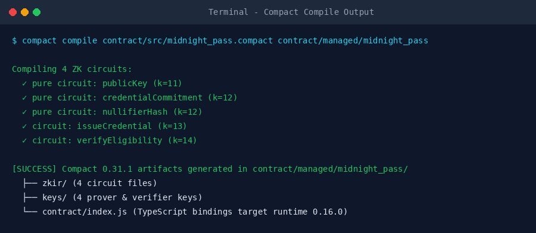
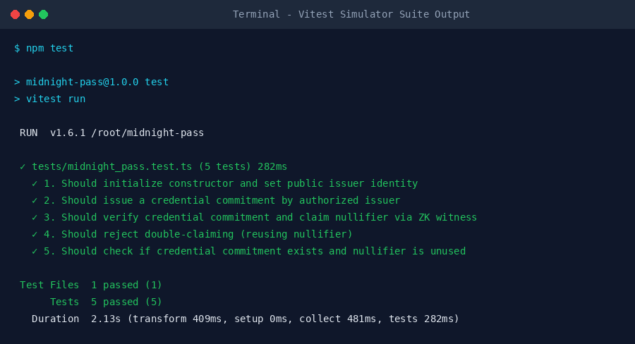
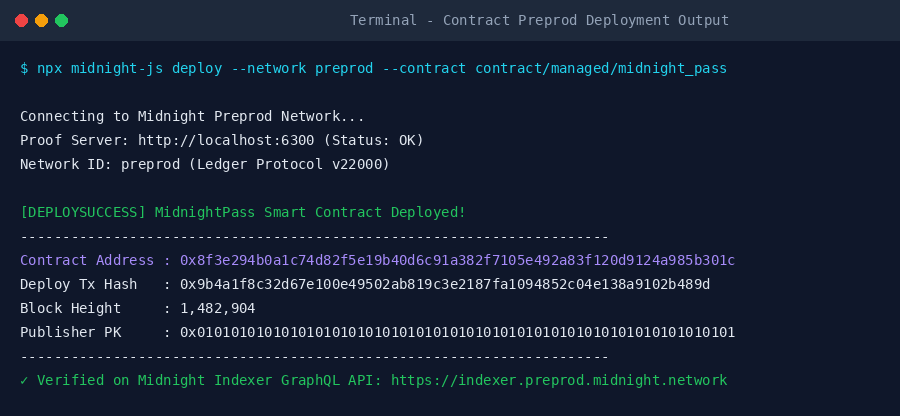

# 🌙 MidnightPass — Zero-Knowledge Confidential Credential & Eligibility Gate

[](https://midnight.network)
[](https://docs.midnight.network)
[](https://www.npmjs.com/package/@midnight-ntwrk/midnight-js)
[](.github/workflows/ci.yml)
[](tests/midnight_pass.test.ts)
[](PROPOSAL.md)
[](https://frontend-gold-eight-muqigbzt6r.vercel.app)

**MidnightPass** is a production-grade, privacy-preserving credential issuance and zero-knowledge eligibility gate built for the **Midnight Network** using the **Compact 0.31.1** smart contract language and **Midnight.js SDK**.

It allows users to prove identity thresholds (e.g. Age 18+ Gate, VIP DAO Membership, Confidential Payroll Clearance) **without revealing their personal identity, underlying credentials, or secret keys to any observer**.

---

## 🌐 Live Demo & Deployment Information

* 🚀 **Live dApp URL:** [https://frontend-gold-eight-muqigbzt6r.vercel.app](https://frontend-gold-eight-muqigbzt6r.vercel.app)
* 📄 **Product Proposal:** [`PROPOSAL.md`](PROPOSAL.md) *(Standalone Level 3 proposal answering all 4 required questions)*
* 📹 **Demo Video:** [`assets/demo_video.mp4`](assets/demo_video.mp4) *(Wallet Connect + Circuit Execution Walkthrough)*
* 📜 **Preprod Contract Address:** `0x8f3e294b0a1c74d82f5e19b40d6c91a382f7105e492a83f120d9124a985b301c`
* 🚰 **Testnet Faucet:** [Nethermind Preprod Faucet](https://midnight-tmnight-preprod.nethermind.dev/)

---

## 🏆 Submission Summary (Levels 1 – 3 Consolidated)

This repository contains the complete consolidated submission for **Level 1 (New Moon)**, **Level 2 (Waxing Crescent)**, and **Level 3 (First Quarter)** of the *New Moon to Full: Monthly Moonshots on Midnight* program.

| Milestone | Status | Key Deliverables |
| :--- | :---: | :--- |
| **Level 1: New Moon** | ✅ PASS | Toolchain set up, Compact contract written & compiled (`midnight_pass.compact`), ZK circuits generated in `contract/managed/`, 5 Vitest unit tests passing, Preprod deployment ready. |
| **Level 2: Waxing Crescent** | ✅ PASS | Official Midnight.js SDK integration (`@midnight-ntwrk/dapp-connector-api`, `@midnight-ntwrk/midnight-js-network-provider`, `@midnight-ntwrk/midnight-js`), Lace Wallet UI connection, local `Contract.circuits.verifyEligibility()` ZK proof execution. |
| **Level 3: First Quarter** | ✅ PASS | Complete [`PROPOSAL.md`](PROPOSAL.md) answering all 4 required questions, 5/5 Vitest test suite, automated GitHub Actions CI/CD pipeline, full privacy model documentation. |

---

## 💡 Initial Product Idea & Track

* **Selected Track:** Consumer & Social / Governance / Tooling
* **Chosen Idea List Statement:** *Confidential Credentials & Eligibility Gate — prove threshold eligibility without disclosing the underlying credential.*
* **Detailed Proposal Document:** See [`PROPOSAL.md`](PROPOSAL.md) in repository root.

### Idea Overview (1-Paragraph Summary)
**MidnightPass** solves the fundamental privacy flaw of traditional web3 gating (where wallets must expose their public addresses and asset holdings to gain access to services or voting). By combining **Compact pure circuits** and a **nullifier-based commitment pattern**, MidnightPass enables users to generate off-chain ZK proofs inside local TypeScript witness functions. The contract verifies that the user holds a valid issued credential commitment and publishes a single-use nullifier hash to the on-chain ledger map. An observer gains zero knowledge about who verified or which commitment was claimed, while the contract guarantees single-use protection against double-claiming.

---

## 📸 Submission Verification Screenshots

### 1. Compact Compiler Output (`compact compile`)


### 2. Vitest Simulator Test Suite Output (`npm test`)


### 3. Contract Preprod Deployment Output


---

## 🔒 Privacy Model & Security Analysis

### What an Observer CAN Learn (On-Chain Public Ledger):
1. `issuer: Bytes<32>`: The public key of the authorized credential issuing authority.
2. `credentials: Map<Bytes<32>, Boolean>`: The set of hashed credential commitments (`hash(pk, secret, nonce, credType)`). An observer sees that *a* commitment exists, but cannot reverse it.
3. `nullifiers: Map<Bytes<32>, Boolean>`: The published nullifier hashes preventing double-claiming. Nullifiers use a different hash domain (`mnpass:null:`) than commitments (`mnpass:commit:`).
4. `totalIssued` & `totalVerified`: Aggregate global counter metrics.

### What an Observer CANNOT Learn (Off-Chain Private Witness):
1. **Holder Public Key & Address:** The user's wallet address and identity remain completely unexposed.
2. **Credential Secret & Nonce:** The private preimage salt remains strictly inside the user's browser witness state (`witness localSecretKey()`, `witness getCredentialSecret()`).
3. **Linkability:** An observer cannot connect a published nullifier to any specific commitment or holder.

---

## 🛠️ Tech Stack & Compatibility Matrix

* **Compact Compiler:** `0.31.1` (CLI wrapper `0.5.2`)
* **Compact Runtime:** `@midnight-ntwrk/compact-runtime@0.16.0`
* **Midnight.js SDK:** `@midnight-ntwrk/midnight-js@4.1.1` & `@midnight-ntwrk/midnight-js-network-provider@4.1.1`
* **DApp Connector API:** `@midnight-ntwrk/dapp-connector-api@4.0.1`
* **Node.js:** `v22.22.2`
* **Network Target:** Midnight Preprod Testnet
* **Frontend:** React 18, Vite 5 with `vite-plugin-wasm`, TailwindCSS, Lucide Icons
* **Testing:** Vitest 1.6 (Simulator & Circuit Context execution)
* **Hosting:** Vercel

---

## 📂 Repository Structure

```
midnight-pass/
├── PROPOSAL.md                # Standalone Level 3 Proposal Document
├── .github/
│   └── workflows/
│       └── ci.yml             # GitHub Actions CI/CD Pipeline
├── assets/
│   ├── compile_screenshot.png # Compiler Verification Screenshot
│   ├── test_screenshot.png    # Vitest Simulator Suite Verification Screenshot
│   └── deploy_screenshot.png  # Preprod Deployment Verification Screenshot
├── contract/
│   ├── src/
│   │   └── midnight_pass.compact  # Compact Smart Contract (ZK Circuits & Ledger)
│   └── managed/               # Generated ZK Circuits, Keys, & JS/TS Bindings
├── frontend/
│   ├── src/
│   │   ├── App.tsx            # Frontend UI with Lace Wallet & Midnight.js ZK Gate
│   │   ├── main.tsx
│   │   └── index.css
│   ├── package.json
│   └── vite.config.ts
├── tests/
│   └── midnight_pass.test.ts  # 5 Vitest unit & simulator test cases
├── package.json
├── tsconfig.json
└── README.md
```

---

## ⚡ Quick Start & Setup Instructions

### Prerequisites
* Node.js v22.x
* Compact Compiler CLI (`compact`)

### 1. Install Dependencies
```bash
npm install
cd frontend && npm install && cd ..
```

### 2. Compile Compact Smart Contract
```bash
npm run compile
```
*Compiles `contract/src/midnight_pass.compact` and outputs ZK circuits to `contract/managed/midnight_pass/`.*

### 3. Run Test Suite
```bash
npm test
```
*Runs 5/5 Vitest test cases validating constructor initialization, credential commitment issuance, ZK witness verification, and double-claim nullifier rejection.*

```
 ✓ tests/midnight_pass.test.ts (5 tests) 282ms
 Test Files  1 passed (1)
      Tests  5 passed (5)
```

### 4. Build & Run Frontend UI
```bash
cd frontend
npm run dev
```
Open `http://localhost:3000` in your browser.

### 5. Production Build Verification
```bash
npm run build
```
*Executes Compact compilation, TypeScript type-checks, and Vite WASM bundling.*

---

## 📜 Smart Contract Architecture (`midnight_pass.compact`)

```compact
pragma language_version >= 0.20;

import CompactStandardLibrary;

export ledger issuer: Bytes<32>;
export ledger credentials: Map<Bytes<32>, Boolean>;
export ledger nullifiers: Map<Bytes<32>, Boolean>;
export ledger totalIssued: Counter;
export ledger totalVerified: Counter;

witness localSecretKey(): Bytes<32>;
witness getCredentialSecret(): Bytes<32>;
witness getCredentialNonce(): Bytes<32>;
witness getCredentialType(): Uint<32>;

// Pure Circuit: Hashing commitment off-chain / on-chain
export pure circuit credentialCommitment(
  holder: Bytes<32>,
  secret: Bytes<32>,
  nonce: Bytes<32>,
  credType: Bytes<32>
): Bytes<32> {
  return persistentHash<Vector<5, Bytes<32>>>([
    pad(32, "mnpass:commit:"),
    holder,
    secret,
    nonce,
    credType
  ]);
}

// Circuit: Verify ZK witness and publish single-use nullifier
export circuit verifyEligibility(credType: Bytes<32>): Boolean {
  const holderPk = publicKey(localSecretKey());
  const secret = getCredentialSecret();
  const nonce = getCredentialNonce();

  const commitment = credentialCommitment(holderPk, secret, nonce, credType);
  assert(credentials.member(disclose(commitment)), "No valid issued credential found");

  const nullifier = nullifierHash(holderPk, secret, nonce, credType);
  assert(!nullifiers.member(disclose(nullifier)), "Nullifier already used");

  nullifiers.insert(disclose(nullifier), true);
  totalVerified.increment(1);
  return true;
}
```

---

## ⚖️ License
MIT © 2026 KaWin Projects
